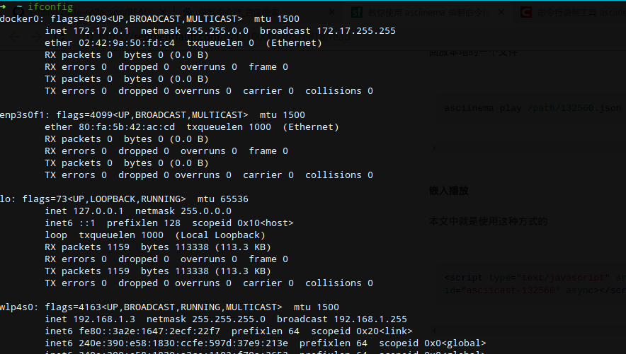
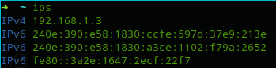

<p align="center"><a href="#" target="_blank" rel="noopener noreferrer"></a></p>

简洁的本地IP查询工具

------

### 当你想要查询本地IP的时候……



是不是瞬间密集恐惧症就上来了？

简洁的本地ip查询工具[IPS](#)来拯救你!

--------------

### 使用教程

命令行运行`ips` 



瞬间拿到ip地址

### 安装

```bash
npm install gips -g
```
